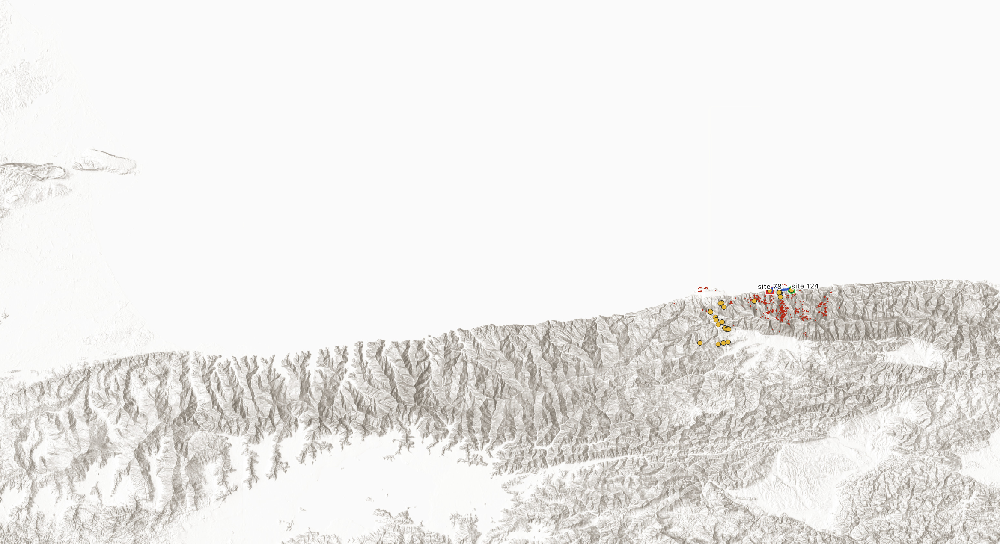
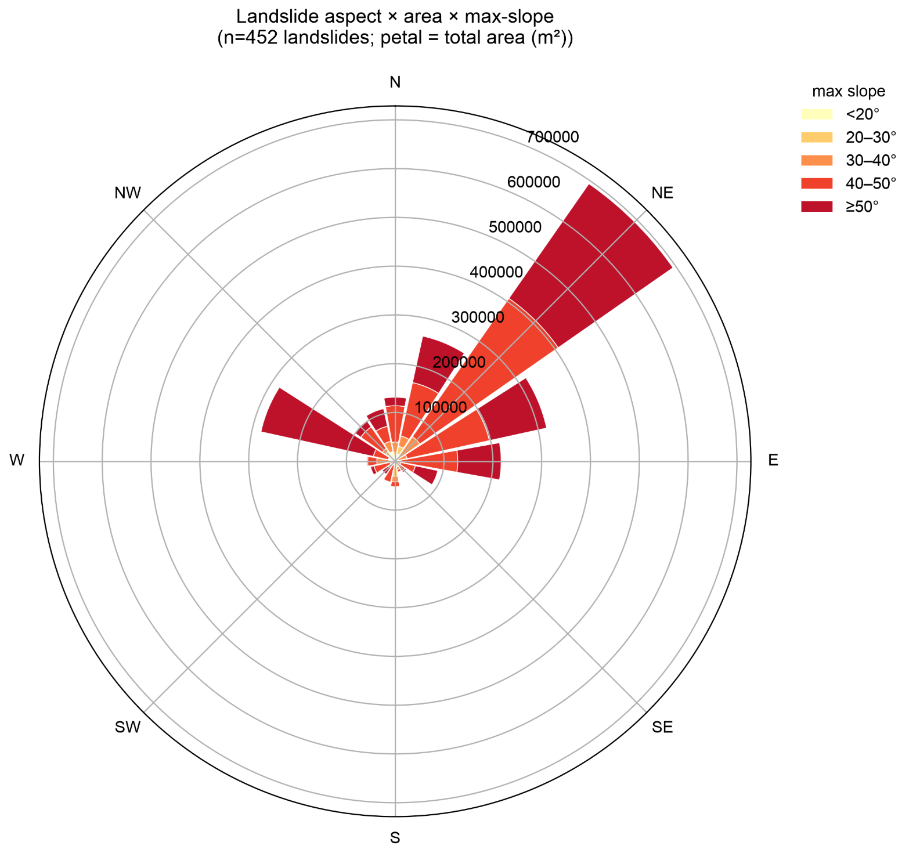

What are we trying to communicate?
- The local context of landsliding in this region 
- The rough order of magnitude of the coseismic landsliding we observed 
- Our best understanding of what we do and do not know about coseismic slope performance 
- How we think the history of precipitation-induced landslides and the June 24, 2026 earthquake may - contribute to current and near-future landslide risks. 
- What opportunities for new understanding exist in the field. 

# 6.2 Seismic Slope Stability and Landslides (working draft) 

## Introduction 

The June 24, 2026 earthquakes triggered numerous scattered landslides across northern Venezuela.
A preliminary assessment of the extent and nature of coseismic landslides was made using satellite imagery and field photos from in-country (_team members? partners? appropriate attribution TBD_).
As shown in Fig. 6.1, the majority of the landslide activity detected was centered in the mountainous region north of Caracas, particularly the area immedately south of Caraballeda. 
Much of the area impacted by strong ground motion had post-event satellite imagery available, however, clear imagery was unavailable in some areas (indicated in Fig. 6.1).
The data sources and dates of imagery are shown in Table 6.1.
<!-- Patricia to collect sources, probably in a table? -->

Approximately XX landslides or landslide areas were identified, covering a total area of XX km^2.
Slides appear to be mostly small, shallow failures with occasional larger slides and retriggered historical landslides.

This inventory is preliminary.
Landslide areas were delineated from post-event satellite imagery by visual interpretation, supplemented by field photos where available, and have not been subjected to a formal quality control or field verification process.
The counts and areas reported here should therefore be read as an order-of-magnitude characterization of the coseismic landsliding rather than a verified inventory.
Coalescing source zones and runout paths were not consistently discretized, and small or vegetation-obscured failures are likely undercounted.

## Background 

The geology of the area is dominated by the Cordillera de la Costa mountain range which rises steeply out of the Carribean Sea.
The range rises to over 2,000 meters elevation within a few kilometers of the coast between Caraballeda and Caracas.
The formation is largely metamorphic rock with abundant fractures and a thin mantle of residual soil and colluvium over steep slopes.

The area has a history of landslides, including the destructive debris flows and flash floods struck the region on December 16, 1999.
The 1999 slides were caused by heavy rainfall and primarily affected the northern slopes of the Cordillera de la Costa mountain range near Caraballeda.
Significant portions of the slopes were denuded during the 1999 slides.
(_I don't have enough information to quantify the amount of landslide source area from 1999 over the entire watersheds, but I think it would be good to have an estimate to compare to the current study._)

In addition to the large magnitude landsliding in 1999, this mountainous region regularly experiences small landslides that contribute to a baseline level of colluvial deposition.
(_Again, I can't quantify this, but it would be nice to be able to put the coseismic deposition volume in perspective._)

## Trends 

### Watersheds
The landslides are concentrated on the northward side of the mountains between Caracas and Caraballeda.
Fig. 6.2 shows the distribution of landslide area by slope orientation.

### Directionality
Fig. 6.3 shows the approximate area of landsliding by watershed which indicates a clear concentration on the slopes towards the north coast around Caraballeda.
In addition to a clear northward trend, the landslides have an eastward concentration, likely attributable to direction of fault displacement, which runs nearly directly westward in the affected region.

The observed distribution is broadly consistent with the USGS Ground Failure product for this event, which also indicates elevated coseismic landslide probability in the mountainous terrain north of Caracas.
(_Confirm against the USGS product before finalizing._)
Because the present inventory is preliminary and has not been independently verified, this comparison is offered as a qualitative observation only, not as an assessment of the predictive model's performance.

## Compounding hazard potential 

It's possible that slides from the 1999 tragedy depleted slopes of loose source material in the lower foothills adjacent to Caracas.
There seems to be a concentration of coseidmic slides at higher elevations which may be caused by the relatively large denuding of lower slopes in 1999.
Regardless, the coseismic colluvium produced after the 2026 event is now source material for future sediment transport and represents an ongoing compouding hazard.

## Site observations 
- Photos from the ground 
- Satellite imagery 
Per Eduardo Garcia: The sites you have as 111 and 114 are very noticeable from several areas in Ccs 

 
## Opportunities for future data collection

**Landslide Inventory and Model Comparison:**
The landslide inventory presented in this section was developed by visual interpretation of post-event satellite imagery and is preliminary.
Development of a quality-controlled inventory for the affected region, applying consistent mapping criteria, discretizing individual source zones from their runout paths, and field-verifying a representative sample, would substantially strengthen the area and count estimates reported here.
The preliminary inventory would serve as the starting point for that effort.
Once a verified inventory is available, future research should undertake a formal comparison against the USGS Ground Failure coseismic landslide product for this event.
The steep, thin-soiled tropical terrain of the Cordillera de la Costa, with its strong antecedent landslide history, represents a demanding test case for regional predictive models.
Such a comparison would be most informative if the inventory is developed independently of the model output.

**Continued Monitoring of Landslide Activity:**
Indicators of ongoing slope movement remain observable in satellite imagery and warrant continued monitoring through at least the next wet season.
Linear groupings of dead vegetation in landslide-prone areas indicate recent movement, where downslope vegetation has been damaged by runout.
Color changes associated with vegetation damage may only become apparent in the weeks following the triggering event, so repeat imagery acquisition is necessary to capture failures that were not evident in the imagery available immediately after the earthquakes.
Monitoring would also help resolve whether the apparent enlargement of some slides between the post-event imagery and later field photographs reflects genuine ongoing mass movement.

**Field Investigation of Slope and Deposit Conditions:**
Several field measurements are believed important to resolve questions that satellite imagery alone cannot answer:

- Three-dimensional characterization of landslide source and deposition areas, by remote sensing, for mechanics analysis;
- Headscarp and ground condition in areas without apparent landslide activity;
- Depth of residual soil and root mass over bedrock, in both 1999 and 2026 source areas;
- Runout distance evidence and its distribution at characteristic sites;

Investigation of ground conditions in areas that did not fail would indicate whether the ground shaking introduced increased susceptibility to rain-induced landsliding, by loosening in-situ materials on slopes that have not yet mobilized, in addition to the increased potential for debris flows from newly deposited source material.
Comparison of soil thickness between areas of known 1999 sliding and areas of high 2026 landslide concentration would test the hypothesis that depletion of source material in 1999 limited triggering in the lower foothills adjacent to Caracas.
A comparison of conditions between slopes that mobilized and adjacent slopes that did not could help inform models for earthquake-triggered landsliding in colluvium-mantled terrain generally, not only at this site.
Runout distances cannot be captured consistently from satellite imagery, particularly beneath dense vegetation, and characterizing them at representative sites would inform the nature of the compounding debris flow hazard described above.

