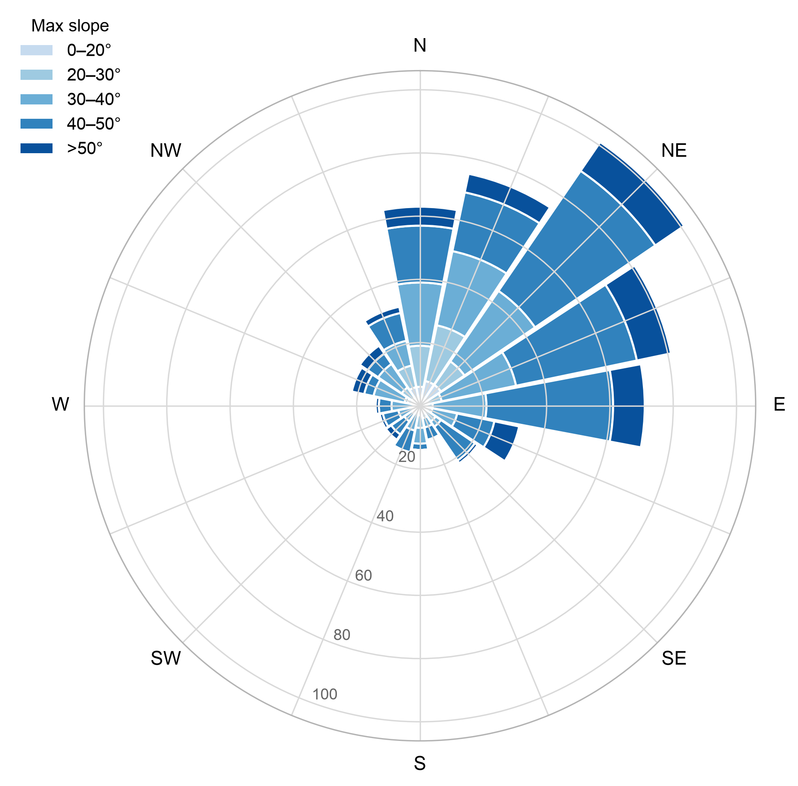

What are we trying to communicate?
- The local context of landsliding in this region 
- The rough order of magnitude of the coseismic landsliding we observed 
- Our best understanding of what we do and do not know about coseismic slope performance 
- How we think the history of precipitation-induced landslides and the June 24, 2026 earthquake may - contribute to current and near-future landslide risks. 
- What opportunities for new understanding exist in the field. 

# 6.2 Seismic Slope Stability and Landslides (working draft) 

## Introduction 

The June 24, 2026 earthquakes triggered widespread landsliding across the Cordillera de la Costa north of Caracas.
Approximately XX landslides or landslide areas, covering a total of XX km^2, were identified from post-event satellite imagery supplemented by field photographs from in-country partners (_appropriate attribution TBD_).
As shown in Fig. 6.1, landslide activity was concentrated in the mountainous terrain between Caracas and the coast, particularly the slopes immediately south of Caraballeda.
Post-event imagery covered most of the area subjected to strong ground motion; areas where clear imagery was unavailable are indicated in Fig. 6.1, and imagery sources and acquisition dates are listed in Table 6.1.
<!-- Patricia to collect sources, probably in a table? -->

Observed landslides were typically small, shallow failures involving the residual soil and colluvium mantle, with occasional larger slides and reactivated historical landslide areas.

This inventory is preliminary.
Landslide areas were delineated by visual interpretation of post-event satellite imagery and have not been subjected to formal quality control or field verification.
<!-- USGS guidance from their data releases and the Nowicki-Jesse model. -->
Coalescing source zones and runout paths were not consistently discretized, and small or vegetation-obscured failures are likely undercounted.
The counts and areas reported here should therefore be read as an order-of-magnitude characterization of coseismic landsliding rather than a verified inventory.

## Background 

The Cordillera de la Costa rises steeply from the Caribbean Sea, reaching elevations over 2,000 m within a 5 to 20 kilometers of the coastline. 
The soils over these mountains are thin, generally 0.5 to 3 m thick (Salcedo, 2000). 

The region has a history of rainfall-triggered landsliding. 
On December 14 to 16, 1999, a storm delivered heavy rainfall in the region, triggering thousands of shallow debris slides and debris flows on the northern slopes of the Cordillera de la Costa. 
An estimated 15,000 to 30,000 people were killed, most of them on the developed alluvial fans below the source slopes rather than in the source areas (Larsen et al., 2001).  

In addition to episodic large events, the range experiences chronic small-scale landsliding that supplies a baseline rate of colluvial deposition. 
Evidence of this background activity was apparent in the pre-event imagery: during mapping, features that resembled fresh coseismic landslides in the post-event imagery were in several cases found to be present before the earthquakes and were excluded from the inventory. 
This background activity was not quantified, and no published background landslide rates are available for the region; by observation, however, the coseismic landsliding was substantially more extensive than the pre-event activity visible in the imagery. 

## Trends 

The mapped landslides show a pronounced northeastward orientation.
Fig. 6.2 presents the distribution of the 602 mapped landslide features by slope aspect (the mean downslope direction of each feature, computed from a 30 m digital elevation model), with each petal stacked by the maximum slope within the feature.
The eastward component of the trend is consistent with fling step asymmetry expected near a fault with westward tectonic permanent displacement (Garini et al., 2011)
The northward component of the trend is consistent with the stronger shaking on the northern side of the Cordillera de la Costa, nearer to the fault.
<!-- The observed distribution is broadly consistent with the USGS Ground Failure product for this event, which also indicates elevated coseismic landslide probability in the mountainous terrain north of Caracas. (actually, only the northward component of the trend because the GF doesn't account for directivity or fling step) -->

<!-- Garini, E., Gazetas, G., & Anastasopoulos, I. (2011). Asymmetric ‘Newmark’ sliding caused by motions containing severe ‘directivity’ and ‘fling’ pulses. Géotechnique, 61(9), 733–756. https://doi.org/10.1680/geot.9.P.070 -->

The implications of the northward facing trend are most pronounced in the mountains between Caracas and Caraballeda, which has a prominent ridge running east-wesst.

## Compounding hazard potential 

It's possible that slides from the 1999 tragedy depleted slopes of loose source material in the lower foothills adjacent to Caracas.
There seems to be a concentration of coseidmic slides at higher elevations which may be caused by the relatively large denuding of lower slopes in 1999.
Regardless, the coseismic colluvium produced after the 2026 event is now source material for future sediment transport and represents an ongoing compouding hazard.

## Site observations 
- Photos from the ground 
- Satellite imagery 
Per Eduardo Garcia: The sites you have as 111 and 114 are very noticeable from several areas in Ccs 

 
## Opportunities for future data collection

**Landslide Inventory and Model Comparison:**
The landslide inventory presented in this section was developed by visual interpretation of post-event satellite imagery and is preliminary.
Development of a quality-controlled inventory for the affected region, applying consistent mapping criteria, discretizing individual source zones from their runout paths, and field-verifying a representative sample, would substantially strengthen the area and count estimates reported here.
The preliminary inventory would serve as the starting point for that effort.
Once a verified inventory is available, future research should undertake a formal comparison against the USGS Ground Failure coseismic landslide product for this event.
The steep, thin-soiled tropical terrain of the Cordillera de la Costa, with its strong antecedent landslide history, represents a demanding test case for regional predictive models.
Such a comparison would be most informative if the inventory is developed independently of the model output.

**Continued Monitoring of Landslide Activity:**
Indicators of ongoing slope movement remain observable in satellite imagery and warrant continued monitoring through at least the next wet season.
Linear groupings of dead vegetation in landslide-prone areas indicate recent movement, where downslope vegetation has been damaged by runout.
Color changes associated with vegetation damage may only become apparent in the weeks following the triggering event, so repeat imagery acquisition is necessary to capture failures that were not evident in the imagery available immediately after the earthquakes.
Monitoring would also help resolve whether the apparent enlargement of some slides between the post-event imagery and later field photographs reflects genuine ongoing mass movement.

**Field Investigation of Slope and Deposit Conditions:**
Several field measurements are believed important to resolve questions that satellite imagery alone cannot answer:

- Three-dimensional characterization of landslide source and deposition areas, by remote sensing, for mechanics analysis;
- Headscarp and ground condition in areas without apparent landslide activity;
- Depth of residual soil and root mass over bedrock, in both 1999 and 2026 source areas;
- Runout distance evidence and its distribution at characteristic sites;

Investigation of ground conditions in areas that did not fail would indicate whether the ground shaking introduced increased susceptibility to rain-induced landsliding, by loosening in-situ materials on slopes that have not yet mobilized, in addition to the increased potential for debris flows from newly deposited source material.
Comparison of soil thickness between areas of known 1999 sliding and areas of high 2026 landslide concentration would test the hypothesis that depletion of source material in 1999 limited triggering in the lower foothills adjacent to Caracas.
A comparison of conditions between slopes that mobilized and adjacent slopes that did not could help inform models for earthquake-triggered landsliding in colluvium-mantled terrain generally, not only at this site.
Runout distances cannot be captured consistently from satellite imagery, particularly beneath dense vegetation, and characterizing them at representative sites would inform the nature of the compounding debris flow hazard described above.

----
My adjusted version afte claude's re-working:
Landslide inventory and model comparison: The landslide inventory presented in this section was developed by visual interpretation of post-event satellite imagery and is preliminary. Development of a quality-controlled inventory for the affected region, applying consistent mapping criteria, would strengthen the estimates reported here. A verified inventory should be compared against predictive models (e.g., the USGS Ground Failure product) for this event. The steep, thin-soiled terrain in Vargas with its strong history of landslide activity is a demanding test case for regional predictive models. 

Continued monitoring of landslide activity: Indicators of ongoing landslide activity warrant continued monitoring to better understand the compounding hazard effects. Color changes in vegetation due to runout damage may only become apparent after several weeks of the triggering event, so repeated imagery review will enhance understanding of the coseismic landslide activity. Additionally, whether known coseismic landslide sites grow (indicating continued colluvium deposition) in the months following the event will improve understanding of the effects of earthquakes on landslide rates and rainfall triggering thresholds. 

Field investigation of slope and soil deposit conditions: Several types of field measurements are important to resolve questions that satellite imagery cannot address: 

    3D characterization of landslide source and deposition areas, by remote sensing, for mechanics analysis, 

    Ground condition surveys for cracking in headscarp areas and areas without apparent lindslide activity, 

    Depth of residual soil and roots over bedrock in and adjacent to 1999 and 2026 source areas, and 

    Evidence of runout distance and its distribution at characteristic sites. 

Ground condition surveys in areas that did not fail would help explain the mechanisms of the relationship between strong ground motion and the increased susceptibility for precipitation induced landslides and debris flows in the years following an earthquake1. Runout distances cannot be captured consistently from satellite imagery, particularly around dense vegetation. Characterizing runout would further inform understanding of the coseismic/precipitation landslide triggering relationship. Comparison of soil thickness between areas of known sliding in 1999 and 2026 could test whether depletion of source material in 1999 limited triggering in the foothills of Cordillera de la Costa. 
----

